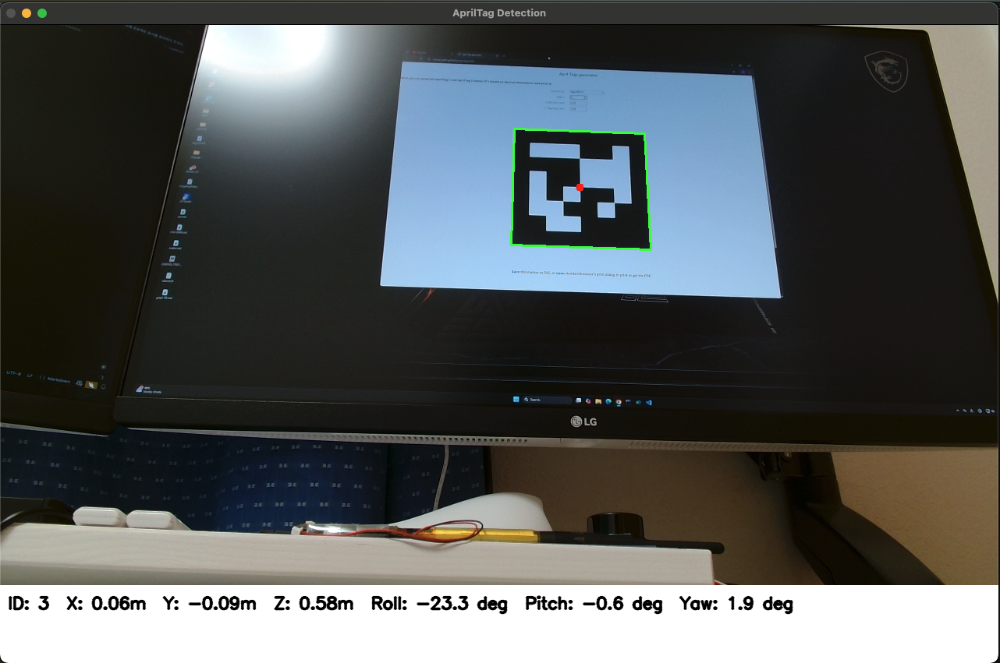

# AprilTag 실시간 인식 및 ROS2 연동 프로젝트 (macOS, Python)

	

## 프로젝트 목적
- USB 웹캠(예: Logitech C920)으로 AprilTag(tag36h11, 10cm x 10cm)를 실시간 인식
- 태그의 ID, 3D 위치(X, Y, Z), 자세(Roll, Pitch, Yaw)를 영상 아래 info 패널에 표시
- ROS2 연동을 위한 정보(ID, X, Y, Z, Roll, Pitch, Yaw) 추출 및 활용 기반 마련

## 주요 기능
- 실시간 카메라 영상 스트림 처리 (OpenCV)
- AprilTag 인식 및 태그 경계/중심 오버레이
- 태그의 3D 위치 및 자세 추정 (pupil_apriltags)
- 영상 아래 info 패널에 ROS2로 퍼블리시할 핵심 정보만 명확하게 표시
- 프로그램 안정성(리소스 해제, 예외 처리 등) 강화

## 파일 구조
- `main.py` : 실행 진입점, 전체 흐름 제어
- `camera_utils.py` : 카메라 관련 함수(해상도 설정 등)
- `apriltag_utils.py` : AprilTag 인식 및 pose 추정 함수
- `visualization.py` : 영상 오버레이, info 패널 표시 함수
- `requirements.txt` : Python 패키지 목록
- `Screenshot.png` : 실행 예시 이미지

## 사용법
1. Python 3.11 가상환경 생성 및 활성화
2. `pip install -r requirements.txt`로 패키지 설치
3. `python main.py` 실행
4. 영상 창에서 태그 인식 결과 및 ROS2용 정보 확인 (q/ESC로 종료)

## 주요 코드 흐름
- camera_utils.py에서 카메라 프레임 획득 (1280x720)
- apriltag_utils.py에서 pupil_apriltags로 태그 인식 및 pose 추정
- 태그의 ID, X, Y, Z, Roll, Pitch, Yaw 추출
- visualization.py에서 영상 아래 info 패널에 정보 표시 및 태그 경계 오버레이
- main.py에서 전체 통합 및 예외/리소스 관리

## ROS2 연동 포인트
- info 패널에 표시되는 정보(ID, X, Y, Z, Roll, Pitch, Yaw)를 ROS2 토픽 메시지로 퍼블리시 가능
- geometry_msgs/Pose 또는 custom msg 활용 가능
- 예시: int32 id, float64 x, y, z, roll, pitch, yaw

## 참고 및 개선 사항
- 카메라 내부 파라미터(fx, fy, cx, cy)는 임시값 사용, 실제 환경에서는 카메라 캘리브레이션 권장
- OpenCV 영상 창의 닫기 버튼(macOS)은 비활성화될 수 있으니 키보드(q/ESC)로 종료
- 각도 단위는 "deg"로 표기하여 호환성 확보
- ROS2 연동, GUI 개선, 멀티태그 지원 등 확장 가능
